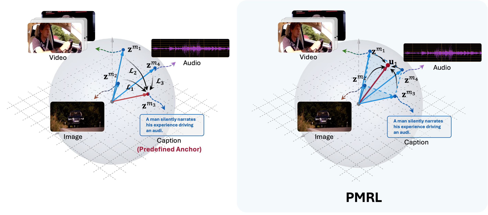
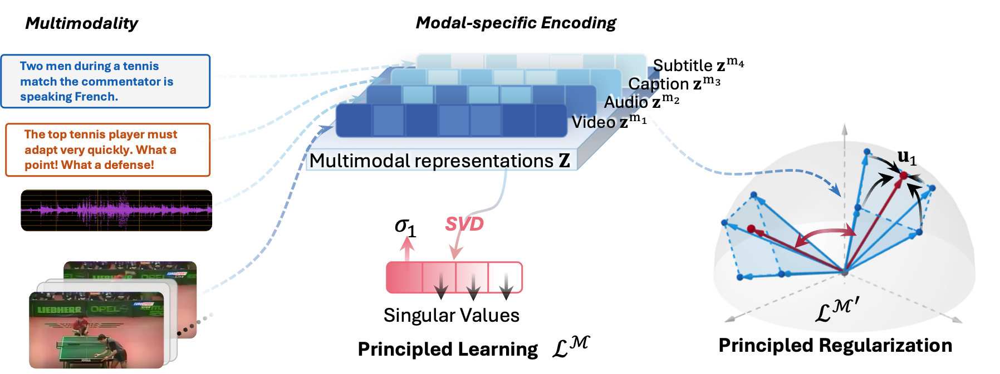

<div align="center">

<h1><a color="red" href="https://arxiv.org/pdf/2507.17343">Principled Multimodal Representation Learning (PMRL)</a></h1>

[](https://opensource.org/licenses/MIT)


*A Novel Framework for Representation Learning Across Multiple Modalities*

</div>

---

## ✨ Overview



**Principled Multimodal Representation Learning (PMRL)** addresses the fundamental challenges in multimodal representation learning by proposing a novel framework that achieves simultaneous alignment of multiple modalities without anchor dependency.

### 💡 Our Solution

PMRL introduces a principled approach grounded in **theoretical insights**:

> **Key Insight**: Full alignment corresponds to a rank-1 Gram matrix

Our framework optimizes the dominant singular value of the representation matrix to align modalities along a shared leading direction.

---

## 🎯 Key Features

🔄 **Simultaneous Multi-Modal Alignment**
- No predefined anchor modality required
- Unified representation space for all modalities

🧮 **Softmax-based Loss Function**
- Treats singular values as logits
- Prioritizes the largest singular value for stable optimization

🎯 **Instance-wise Contrastive Regularization**
- Maintains inter-instance separability
- Prevents representation collapse

⚡ **Distributed Training Support**
- Multi-GPU training capabilities
- Efficient data parallel processing

📊 **Comprehensive Evaluation**
- Extensive benchmarking across diverse tasks
- Quantitative and qualitative analysis tools

---

## 🏗️ Architecture



The PMRL framework consists of three main components:

1. **🔧 Multi-Modal Encoder**: Processes different input modalities
2. **🎯 Singular Value Optimization**: Aligns representations via dominant singular value
3. **🔄 Principled Regularization**: Maintains instance-level discrimination

---

## ⚡ Quick Start

```bash
# Clone the repository
git clone https://github.com/your-username/PMRL.git
cd PMRL

# Install dependencies
bash preinstall.sh

# Run a quick training example

```

---

## 🔧 Installation

### Prerequisites

- **Python** 3.8 or higher
- **CUDA** 11.0 or higher (for GPU support)
- **8GB+ RAM** recommended

### Preinstallation

```bash
# Clone repository
git clone https://github.com/your-username/PMRL.git
cd PMRL

# Run installation script (includes all dependencies)
bash preinstall.sh
```

### Download basic encoder's checkpoints
The encoder architecture follows VAST. Make a dir named pretrained_weights under the main work dir.

1.download evaclip weight:
```
wget -P pretrained_weights/clip/ https://huggingface.co/QuanSun/EVA-CLIP/resolve/main/EVA01_CLIP_g_14_psz14_s11B.pt
```
2.download beats weight from https://github.com/microsoft/unilm/tree/master/beats

3.download bert weight:
```
from transformers import BertModel, BertTokenizer
bert = BertModel.from_pretrained('bert-base-uncased')
bert_tokenizer = BertTokenizer.from_pretrained('bert-base-uncased')
bert.save_pretrained('pretrained_weights/bert/bert-base-uncased')
bert_tokenizer.save_pretrained('pretrained_weights/bert/bert-base-uncased')
```


The processed  pretrained_weights path should be as follows:
```
    ├── pretrained_weights
    │   ├── beats
    │   │   └── BEATs_iter3_plus_AS2M.pt
    │   ├── bert
    │   │   └── bert-base-uncased
    │   ├── clip
    │   │   └── EVA01_CLIP_g_14_psz14_s11B.pt
```

Also, download the vast weights as a start checkpoint in [VAST](https://github.com/TXH-mercury/VAST).

## 🚦 Usage

### Training

```bash
# Basic training
python run.py \
    --config config/vast/default_run_cfg.json \
    --model_config config/vast/default_model_cfg.json

# Training with custom parameters
python run.py \
    --config your_config.json \
    --model_config your_model_config.json \
    --output_dir ./outputs/experiment_1 \
    --learning_rate 1e-4 \
    --num_train_steps 10000
```

### Evaluation

```bash
# Evaluation mode
python run.py \
    --config config/vast/default_run_cfg.json \
    --model_config config/vast/default_model_cfg.json \
    --mode testing \
    --checkpoint path/to/your/model.pt
```

### Zero-shot Evaluation

```bash
# Zero-shot testing
python run.py \
    --config config/vast/default_run_cfg.json \
    --model_config config/vast/default_model_cfg.json \
    --zero_shot true
```

### Distributed Training

```bash
# Multi-GPU training
torchrun --nproc_per_node=4 run.py \
    --config config/vast/default_run_cfg.json \
    --model_config config/vast/default_model_cfg.json \
    --use_ddp true
```

---

## 📊 Experiments

Our comprehensive evaluation includes:

### Datasets
- **Vision-Language**: COCO, Flickr30K, Conceptual Captions
- **Audio-Visual**: AudioSet, VGGSound, MUSIC
- **Video-Text**: MSR-VTT, VATEX, ActivityNet

### Benchmarks
- **Cross-modal Retrieval**: Image-Text, Audio-Visual, Video-Text
- **Multimodal Classification**: Fine-grained recognition tasks
- **Zero-shot Transfer**: Cross-domain generalization

### Metrics
- **Retrieval**: Recall@K, Mean Rank, Mean Reciprocal Rank
- **Classification**: Accuracy, F1-Score, mAP
- **Alignment**: Singular Value Analysis, Representation Quality

---

## 📁 Project Structure

```
PMRL/
├── 📄 README.md                 # Project documentation
├── 🐍 run.py                    # Main entry point
├── 🔧 preinstall.sh            # Installation script
├── 📋 LICENSE                   # MIT License
├── 📁 config/                   # Configuration files
│   └── 📁 vast/
│       ├── default_run_cfg.json
│       ├── default_model_cfg.json
│       ├── 📁 pretrain_cfg/
│       └── 📁 finetune_cfg/
├── 📁 model/                    # Model implementations
├── 📁 utils/                    # Utility functions
│   ├── args.py                 # Argument parsing
│   ├── initialize.py           # Initialization
│   ├── build_model.py          # Model building
│   ├── build_optimizer.py      # Optimizer setup
│   ├── build_dataloader.py     # Data loading
│   └── pipeline.py             # Training/testing pipeline
├── 📁 data/                     # Data processing
├── 📁 datasets/                 # Dataset implementations
├── 📁 evaluation/               # Evaluation scripts
├── 📁 evaluation_tools/         # Evaluation utilities
├── 📁 scripts/                  # Helper scripts
├── 📁 pretrained_weights/       # Pre-trained models
├── 📁 model_weights/            # Trained model weights
├── 📁 outputs/                  # Training outputs
└── 📁 img/                      # Documentation images
    ├── top.png
    └── framework.png
```

---

## ⚙️ Configuration

### Run Configuration (`default_run_cfg.json`)

```json
{
  "mode": "training",              
  "learning_rate": 1e-4,           
  "num_train_steps": 10000,        
  "valid_freq": 10,                
  "log_steps": 100,                
  "output_dir": "./outputs",       
  "fp16": true,                   
  "use_ddp": true,                 
  "seed": 50                       
}
```

### Model Configuration (`default_model_cfg.json`)

Customize your model architecture, loss functions, and training parameters through the model configuration files.

### Custom Configurations

Create your own configuration files:

```bash
# Copy default configs
cp config/pmrl/default_run_cfg.json config/pmrl/my_experiment.json
cp config/pmrl/default_model_cfg.json config/pmrl/my_model.json

# Edit configurations
vim config/pmrl/my_experiment.json
```

---


<div align="center">


**[🔝 Back to Top](#-principled-multimodal-representation-learning-pmrl)**

</div>
